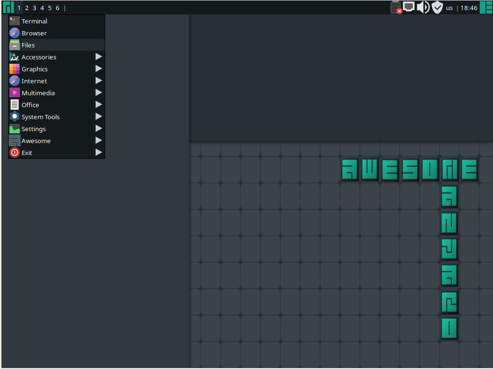

#Distributions
##[openSUSE](https://www.opensuse.org/)

##[Manjaro](https://manjaro.org/)

##[PopOS](https://system76.com/pop)

##[Fedora](https://ubuntu.com/)

##[Ubuntu](https://ubuntu.com/)

## Useful Linux Utilities
* ***ls*** - List files in the directory
* ***find*** - Search for path name, by name, size, regex match and many more
 * ***find -name pattern***  will match the ***base*** of a file name against the shell pattern specified by the argument. The pattern arg should be quoted to prevent the shell to do file name expansion before its execution. 
   * ***find -regex pattern*** Will match the ***full*** path name of any file to the pattern. *regex* is emacs-style regex, but you can use -regextype to override the regex flavour used.
   * ***find -exeutable*** will return any file that has its execution mode bit set.
   * ***find -perm mode*** Will match the permission files the permission mode arg.
   * ***find -prune*** will ignore the content of any directory matched by previous predicates. If you want to ignore the directory itself to, you should and '-o' for or, before specifying the following predicates that if true, will execute the '-print' action.
* ***chmod*** - Change the permission mode for owner/group/other, to update their read/write/execute permissions.
* ***chown*** - Changes the owner/group attributes of a file.
* ***man*** - Show help for commands.
* ***cat*** - Output the file's context to standard out.
* ***head*** - Outputs the top of stdin or a file.
* ***tail*** - Outputs the bottom of stdin or a file. Useful for following logs, especially with the -f switch.

#Shell
When launching a terminal, you are interacting with a shell program from the command-line. Most distribution define ***bash*** as the default shell, while some have the minimal ***ash***, or ***sh*** as the default shell. There is another 3rd popular shell: ***zsh***.
 
The basic ***sh*** program lacks the rich features of modern shells such as: *command completion* *file-name completion* *command-history* and many more.
Other shells were popular back in the day, among the prominent one were ***tsh*** and its derivative ***tcsh***, which were pioneers in many advance features of command-line interactive editing, such as command and file-name or history completion and many others. While proving to be very influential in many aspects of shell innovation, especially the interactive aspects, it was strongly criticized in [Csh Programming Considered Harmful](http://www.faqs.org/faqs/unix-faq/shell/csh-whynot/) for its occasional parsing errors and random bugs. File descriptor handling and other advanced features were lacking.
###Resources:
* [linux.com](https://www.kernel.org/)
